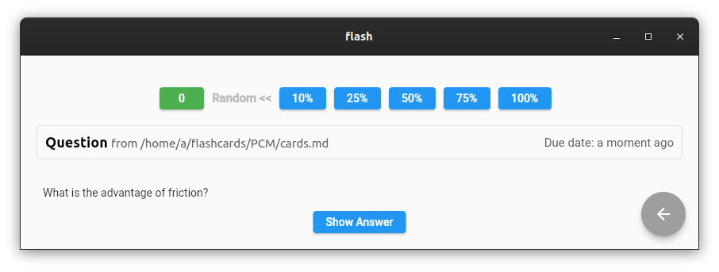
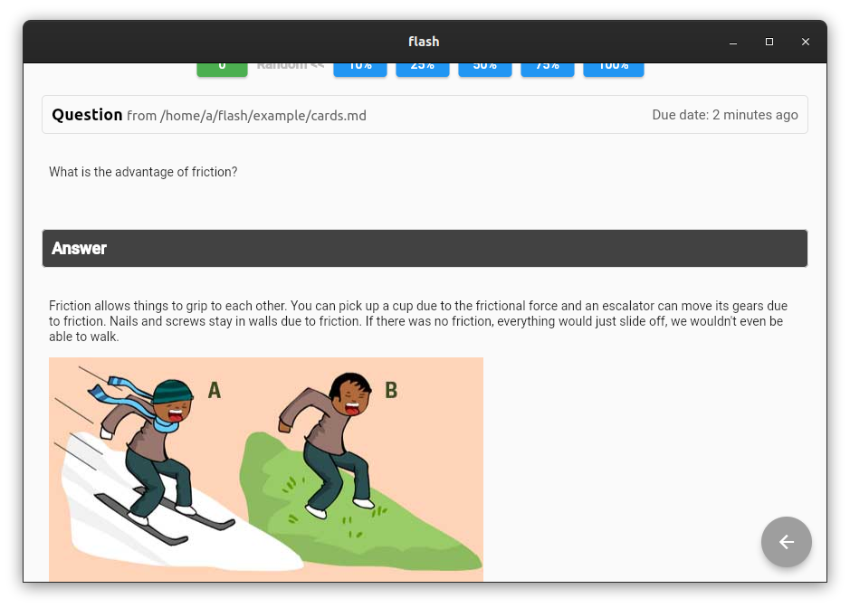
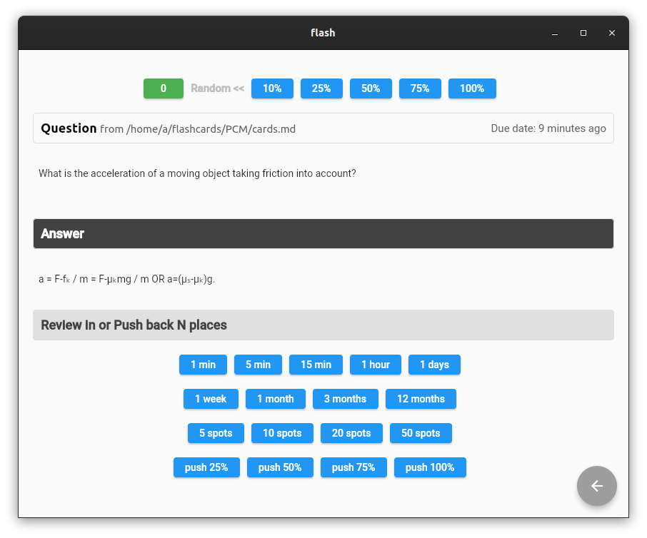

# flashc

A markdown based flash card app, but one that makes it much easier to create cards and so on. Anki and etc tend to be painful for new users, and it shouldn't be. 

Mainly for my own casual usage for now..

```
TODO:

 - Maybe add how many cards are in the deck..
 - Recently reviewed folders
 - AI for flash card generation, improvement etc etc.

```







From a file like this,

```
<!##--

  Physics
  
  1) Intro to Friction
  
  2) Equations related to friction

##--!>

<!##-- 1) Intro to Friction ##--!>

<-- question -->
What is the advantage of friction?


<-- answer -->

Friction allows things to grip to each other. You can pick up a cup due to the
frictional force and an escalator can move its gears due to friction. Nails
and screws stay in walls due to friction. If there was no friction, everything
would just slide off, we wouldn't even be able to walk.


<-- end -->
<-- question -->
What are the disadvantages of friction?


<-- answer -->

Frictional force needs to be beat in order for an object to move, wasting more
energy. It also causes wear and tear of parts along with unnecessary heating.


<-- end -->
<-- question -->
What are the methods of reducing friction?


<-- answer -->

Polishing (only to an extent; too much will increase intermolecular
attractions and strengthen friction), lubrication, ball bearings (rolling
friction is less than sliding friction), streamlining and leaving a thin
cushion of air.


<-- end -->

<!##--

  2) Equations related to friction

##--!>

<-- question -->
What is the applied force to an object if the force doesn't make the object
move?


<-- answer -->

F=µₛN => ma=µₛmg => a=µₛg.


<-- end -->
<-- question -->
What is the acceleration of a moving object taking friction into account?


<-- answer -->

a = F-fₖ / m = F-µₖmg / m OR a=(µₛ-µₖ)g.


<-- end -->
<-- question -->
What is the displacement of an object if its given an initial velocity of u
and friction is the only horizontal force acting on it.


<-- answer -->

s=u²/µₖg.


<-- end -->
```

# tl;dr

```
Takes a folder containing cards.md markdown file => stores it into a sqlite3 db

Editing the individual 'cards' in the md file, refreshes the db and places them at the start of the to
be reviewed order.

Going through the cards in the db, you can push cards in the review order, or set future review dates.

I wanted to give the user more power on deciding when to review cards again, and the app is meant to be
used endlessly in a casual manner.

For example, if you have no idea about a card, it's fine to leave it in, just push it into the future,
as you should learn more each 'pass' through the cardset, and eventually that card could be understood.
```

# cards.md

The card set has to be called cards.md for now. Maybe in the future, it'd be better to allow multiple
markdown files, and the user can choose which 'one' to review, but that seems un-necessary at this stage
and usage level.

### Comments

```
<!##--

  comment, useful for allowing the user to search through the cards.md and organise cards.

##--!>

or

<!##-- a single line comment ##--!>
```

### Card

A card starts with a

```
<-- question -->

the question side goes here,

most markdown features work here, including images.

<-- answer -->

the answer side goes here

<-- end -->
```

### Buttons

#### **Top**

The green 0 button => gets the card that's at the front of the queue.

The 10, 25, 50 etc buttons => gets a random card from within 0-10%, 0-25% and so on, given the ordered set of review dates.

#### **Bottom**

Allows to push cards via review_time, or simply pushes the card N cards back in the order.
